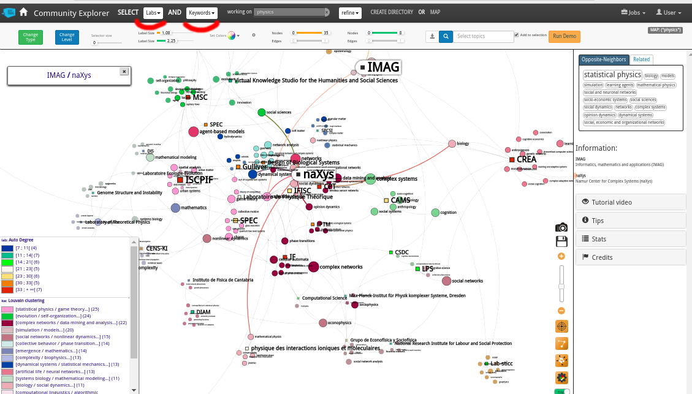

Community Explorer v.2
======================

## Overview
Community explorer is a platform for any open directory of users and themes (keywords).
It can provide cross-filtered views of the directory members as charts and networks:
  - by name, themes or hashtags
  - by affiliation and country

It is deployed online at [communityexplorer.org](https://communityexplorer.org).





It can also be deployed in your own lab or community thanks to:
  - its [docker packaging](https://github.com/moma/comex2/tree/master/setup/dockers)
  - a set of easily modifiable [templates](https://github.com/moma/comex2/tree/master/templates)
  - its open licence in aGPLV3.

## Setting up the server

### Running it directly [for development]
See [`doc/dev_setup.md`](https://github.com/moma/comex2/blob/master/doc/dev_setup.md)

### Running it wrapped in docker [for production]
Prerequisites:
  - [`docker`](https://www.docker.com/)
  - [`docker-compose`](https://docs.docker.com/compose/install/) (>= v. 1.7.0)  

##### 1) Get the app
```shell
git clone https://github.com/moma/comex2.git
```

##### 2) Set up the doors connection
The only out-of-package dependency is an external authentication server called doors.

To deploy doors, follow the instructions at [their repository](https://github.com/ISCPIF/doors)

Then the environment variable `DOORS_HOST` must simply be set to your doors server's hostname or IP, and `DOORS_PORT` to the doors server's exposed port, or none if it's ports 80/443.

To set these simply access the config file:

```shell
nano config/parametres_comex.ini
```


##### 3) Prepare mounted directories
The following 2 directories will be mounted inside the docker If you have no previous data, just create them empty.

```shell
# prepare the data/ directory (or copy one if you already have data)
mkdir data/shared_mysql_data

# prepare the logs/ directory
mkdir logs
```

Your sql data will always be there under `data` and the logs are under `logs/services.log`.

##### 4) Run the docker
```shell
# build the components
cd setup/dockers
sudo docker-compose build

# run them and link them
sudo docker-compose up

# at this point your comex app is operational on http://localhost:8080
#                                  ----------------------------------
```

##### 5) Optional: prepare static file
In your nginx conf below you can choose to shortcut to the static files directly without the docker. In this case do this additional step to adapt all relative paths inside the only static html file on this server (originating from the ProjectExplorer/TinawebJS package)

```shell
cd static/tinawebJS/
bash twtools/adapt_html_paths.sh 'static/tinawebJS/'
#                                 ^^^^^^^^^^^^^^^^^
#                          your relative http route to the dir
```

##### 6) Optional: Nginx
After `docker-compose up`, the app is accessible on http://localhost:8080.

We can ask nginx to reverse-proxy our app with a minimal conf:

```
# nginx exemple
server {
    listen 80;

    # proxy to the running docker container
    location / {
        proxy_pass http://0.0.0.0:8080;
    }

    # optional shortcut to static files w/o docker
    location /static {
        alias  /PATH/TO/YOUR/comex2/static;
    }
}
```
See the [detailed doc](https://github.com/moma/comex2/blob/master/doc/nginx_conf.md) and a [typical production conf file](https://github.com/moma/comex2/blob/master/setup/comex2_deployed_outer.nginx.conf) for a real-life configuration example.

**Your app is now accessible directly on `http://localhost`.**

### Operational schema
```
#                                               |-------------------|
          your-server:80 or :443 <------------> |  Doors external   |
                   ___                          |    auth server    |
                    |                           |-------------------|
           |------------------|
           |    your nginx    |
           |------------------|
                    |
             your-server:8080  
                    |
                    |
                    |
                    |                                    mounted data/ dir
                    |                                             |
        --------------------------------                          |
      / D O C K E R   C O N T A I N E R  \                        |
                    |                                             |
          |---------------------|                                 |
          |     inner  nginx    |                                 |
          |---------------------|                                 |
               /            \                                     |
              /              \                                    |
      (reverse proxy)        $host/                               |
      $host/services/           \                                 |
            |                    \                                |
 |----------------------------------------------|       |-----------------|
 |     (python3 server      +    php pages)     | <---> |  mysql docker   |
 |- - - - - - - - - - - - - - - +---------------|       |      with       |
 |                              |                       |  "comex_shared" |
 | services/api | services/user | <-------------------> |-----------------|
 |------------------------------|
```

In production, you may want to have the app run at boot. In that case, see the [startup script doc](https://github.com/moma/comex2/blob/master/doc/startup_script.md) on this subject.

## About the data

All user data and keywords list and occurrences are in a MySQL database in the app's directory **`data/shared_mysql_data`**,

Uploaded images are in `data/shared_user_img`.

### DB structure

##### Overview
  - the DB name is *`comex_shared`*  
  - `scholars` is the main table:
     - a local user id (aka **luid**) is the primary key
     - a unique external doors_uid (the user id for the entire lab)
     - a unique email
  - we have five related tables
    - `orgs` for labs and institutions
      - and sch_org for scholars <=> organisms mapping
    - `keywords`
      - and `sch_kw` for scholars <=> keywords mapping
    - `hashtags`
      - and `sch_ht` for scholars <=> hashtags mapping
    - `jobs`
      - and `job_kw` for jobs <=> keywords mapping
    - `linked_ids` for other ids of the researcher (eg: [ORCID](http://orcid.org/), not used yet)

##### More info
Full table structure is described in [this documentation file](https://github.com/moma/comex2/blob/master/doc/table_specifications.md).

Some common maintenance operations have example scripts in the `setup/toolbox` folder.

##### Exemple queries
```SQL

-- ==========================
-- FOR SCHOLAR + AFFILIATIONS
-- ==========================
SELECT
    scholars.*,
    orgs.*
FROM scholars
LEFT JOIN sch_org
    ON luid = sch_org.uid
JOIN orgs
    ON orgs.orgid = sch_org.orgid ;

-- NB: scholars <=> orgs is a one-to-many relationship
--     so this can return multiple lines
--  => in the app we use GROUP_CONCAT(orgs.label) or GROUP_CONCAT(orgs.toarray)
--     to fit in the scholars cardinality)


-- ==================================
-- FOR SCHOLAR + KEYWORDS IN ONE LINE
-- ==================================
SELECT
    scholars.*,
    COUNT(keywords.kwid) AS keywords_nb,
    GROUP_CONCAT(kwstr) AS keywords_list
FROM scholars
JOIN sch_kw
    ON luid = uid
JOIN keywords
    ON sch_kw.kwid = keywords.kwid
GROUP BY uid ;
```

### User and registration service
The comex app was refactored and merged in dec 2016 with a new registration form server

  - the form is served by [flask](http://flask.pocoo.org/) and uses [javascript functions](https://github.com/moma/comex2/blob/master/static/js/comex_reg_form_controllers.js) for validation etc  
  - the registration credentials are transmitted to an authentication portal: Doors prototype  
  - the answers are POSTed back to server that writes new users in a local DB  

More info in `doc/` directory

### Project History Overview
This project first started as a side-project of the EU FET Funded TINA project (2009-2011) coordinated by David Chavalarias (CNRS). It was endorsed by the Complex Systems Institute of Paris Ile-de-France (ISC-PIF), the Complex Systems Society and the French National Network for Complex Systems.

The development have been conducted under the scientific supervision of David Chavalarias :
-  The core of the plateform is based on the TinawebJS online bipartite graph visualization software developed at CNRS/ISC-PIF by Julian Bilke (2009-2011) and Samuel Castillo (2012-2015).
- The community explorer was refactored by Romain Loth (CNRS/ISC-PIF) in 2016-2017 for a more flexible deployment, enhanced data matching apis, job board functions and better user interface.
- The community explorer use the DOORS platform for user identification (https://github.com/ISCPIF/doors)

##### Copyright
See the Community Explorer Software Copyright (c) 2017 CNRS ISC-PIF - http://iscpif.fr

Licences:
    - GNU aGPLV3
    - a CECILL variant affero compliant
